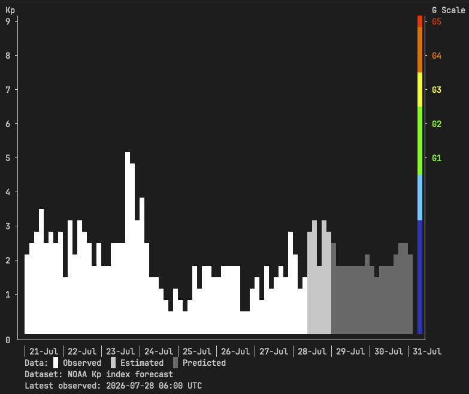
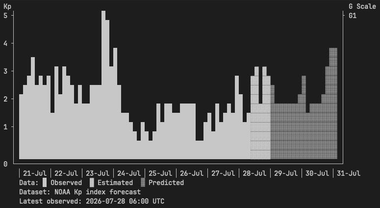

# SWx

SWx is a small macOS command-line tool that downloads the current planetary Kp
index forecast from the NOAA Space Weather Prediction Center and displays it as
either a Unicode terminal chart or a text report.

## Current capabilities

- Downloads the live [NOAA planetary K-index forecast](https://services.swpc.noaa.gov/products/noaa-planetary-k-index-forecast.json).
- Displays observed, estimated, and predicted Kp values in a terminal chart.
- Reports the UTC timestamp of the latest observed chart value.
- Provides an alternative line-by-line text report.
- Displays the Kp scale alongside the corresponding geomagnetic storm scale
  (`G1` through `G5`).
- Marks the highest observed and forecast values in the text report.
- Treats NOAA timestamps and chart date boundaries as UTC.
- Reports invalid data, configuration, and HTTP responses as command-line errors.

In a colour-capable terminal, the chart uses solid blocks with a different shade
for each type of Kp value:

| Colour | Meaning |
| --- | --- |
| White | Observed |
| Light grey | Estimated |
| Dark grey | Predicted |

The right-hand G scale and its activity band follow the
[BGS geomagnetic activity colours](https://geomag.bgs.ac.uk/education/activitylevels.html):
dark blue for quiet, cyan for active, green for G1 and G2, yellow for G3,
orange for G4, and red for G5. When colour is unavailable, observed, estimated,
and predicted values use `█`, `▓`, and `░` respectively. The `NO_COLOR`
environment variable is supported.

## Chart examples

Full-scale colour output (`--full-scale`):



Default-scale monochrome output (`--color never`):



## Requirements

- macOS 10.15 or later
- Swift 5.10 or later
- An internet connection to retrieve the NOAA dataset

Swift Package Manager downloads the
[swift-argument-parser](https://github.com/apple/swift-argument-parser)
dependency automatically.

## Build and run

Clone the repository and change into its directory:

```sh
git clone https://github.com/firecrestHorizon/SWx.git
cd SWx
```

Run the terminal chart:

```sh
swift run swx
```

Force the chart to display the complete Kp 0–9 and G1–G5 scales:

```sh
swift run swx --full-scale
```

Override automatic colour detection when needed:

```sh
swift run swx --color always
swift run swx --color never
```

Run the line-by-line text report:

```sh
swift run swx --text-output
```

The explicit subcommand form is also supported:

```sh
swift run swx kp-forecast --text-output
```

For a release build:

```sh
swift build -c release
.build/release/swx
```

Use `--help` to see the available commands and options:

```sh
swift run swx --help
```

## Output formats

The terminal chart is displayed by default. Use `--format` to select a
non-chart representation:

```sh
swift run swx kp-forecast --format text
swift run swx kp-forecast --format json
swift run swx kp-forecast --format csv
```

Text mode groups records by UTC date, marks the transition from observed data
to the forecast, and shows the trend from the preceding Kp value. A filled
diamond marks the observed peak and an outlined diamond marks the forecast
peak.

```text
Planetary Kp forecast · UTC

Date         Time   Kp    Type         G    Trend
Mon 27 Jul  18:00   1.67  observed     —    — ◆

-------------------- FORECAST --------------------

             21:00   3.67  estimated    —    ↑
Tue 28 Jul  00:00   5.33  predicted    G1   ↑ ◇

◆ Peak observed   ◇ Peak forecast
```

JSON uses SWx's versioned canonical envelope:

```json
{
  "schemaVersion": 1,
  "dataset": {
    "id": "planetary-kp-forecast",
    "name": "Planetary Kp Forecast",
    "provider": "NOAA SWPC"
  },
  "generatedAt": "2026-07-28T18:05:12Z",
  "timeZone": "UTC",
  "records": [
    {
      "timestamp": "2026-07-29T00:00:00Z",
      "status": "predicted",
      "data": {
        "kp": 5.33,
        "noaaScale": "G1"
      }
    }
  ]
}
```

The envelope and record metadata are shared across datasets; fields inside
`data` belong to the individual dataset. CSV provides the flat columns
`timestamp`, `status`, `kp`, and `noaa_scale`. Both structured formats use ISO
8601 UTC timestamps and contain no terminal styling.

## Tests

Run the decoder and renderer regression tests with:

```sh
swift test
```

The tests include a representative NOAA response and checks for invalid data,
unknown observation types, chart rounding, full-scale rendering, BGS activity
bands, colour and monochrome output, latest-observation metadata, and report
maximum markers.

## Data source

Data is retrieved on each run from NOAA's
`noaa-planetary-k-index-forecast.json` product. SWx does not cache the response
or provide an offline dataset.
